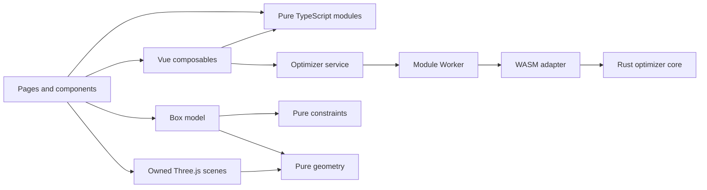
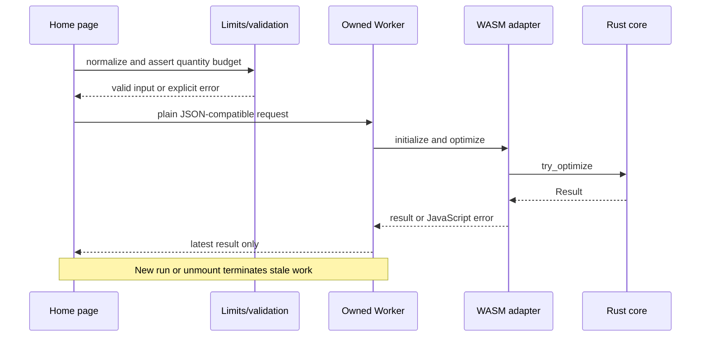
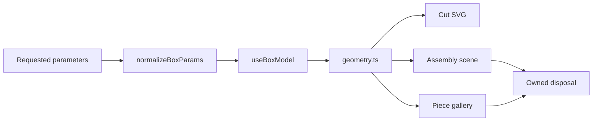

# CutLog architecture

Status: v0.1.54 review, after seven implementation iterations. This document is
the map of responsibilities and dependency rules. The canonical list of 510
findings and ideas is [recommendation.md](recommendation.md); the quick
setup and reading path are in [README.md](README.md). The
[100-repository benchmark](docs/top-100-repository-benchmark.md) records the
external comparison behind iteration 5. `plan.md` is historical brainstorming,
not a second source of backlog truth.

CutLog is intentionally a small, local-first application. Its architecture
should make correctness visible and changes easy to review, not imitate a large
distributed system.

## 1. System map



There are two product flows:

- **Cutting Optimizer:** Vue editor -> validated state -> cancellable Worker ->
  WASM adapter -> fallible Rust core -> typed result -> accessible sheet cards.
- **Box Builder:** Vue controls -> normalized constraints -> one geometry source
  -> SVG and Three.js renderers, each with explicit resource ownership.

Nothing leaves the browser. Project persistence uses local browser storage;
share links contain encoded state and must therefore be treated as untrusted
input when opened.

## 2. Layers and ownership

| Layer | Current paths | Owns | Must not own |
|---|---|---|---|
| Contracts | `frontend/src/services/types.ts` | Cross-layer data shapes | Vue refs, DOM, storage |
| Pure domain/presentation logic | `frontend/src/lib/*`, `box/constraints.ts`, `box/geometry.ts` | Parsing, validation, limits, transforms, serialization, geometry, presentational calculations | Vue, browser effects, translations, Worker lifecycle |
| Services | `frontend/src/services/*` | Worker protocol, WASM loading, JS/Rust adaptation | UI state, toasts, localStorage |
| Reactive effects | `frontend/src/composables/*`, `box/useBoxModel.ts`, `box/three/*` | Timers, storage, listeners, reactive orchestration, WebGL lifecycle | Unrelated product concerns |
| Presentation | `frontend/src/components/*`, `pages/*` | Labels, controls, layout, events, focus | Algorithms, persistence formats, resource allocation rules |
| Rust core | `crates/core` | Packing models, algorithms, capacity invariant | Browser and CLI concerns |
| Rust adapters | `crates/wasm`, `crates/cli`, `crates/ui` | Boundary conversion and output surfaces | Duplicate optimizer rules |

Dependency direction is inward:

```text
pages/components -> composables -> services -> Worker/WASM -> Rust core
        |                |              |
        +----------------+------------> pure TypeScript/types
```

Pure modules may depend on other pure modules and types. They never import Vue,
components, composables, stores, `window`, localStorage, or Three.js. Services
never import pages. A page may assemble several narrow modules, but it should
not reimplement their policy. `frontend/scripts/check-boundaries.mjs` runs in
both `npm test` and `npm run build` and machine-enforces: the layer import
directions above (including `helpers/`), bare `vue`/`vue-router`/`three`
imports in `lib/` and `helpers/`, and the page line budget. Direct `window` or
`localStorage` access in pure modules is not detectable by the import scanner
and remains a review rule.

## 3. SOLID and DRY in this repository

These principles are review rules, not reasons to add abstraction by default.

### Single Responsibility

- `optimizerLimits.ts` owns quantity-budget policy.
- `optimizerWorker.ts` owns one calculation lifecycle.
- `useHomeStorage.ts` owns storage timing and errors.
- `useHomeHistory.ts` owns undo/redo timing and restore guards.
- `useProjectSnapshots.ts` owns named-snapshot persistence.
- `usePieceList.ts` owns piece CRUD, filters, transforms, and ordering.
- `pieceIdentity.ts` owns opaque, unique source identity at trust boundaries.
- `useProjectState.ts` owns project refs and detached read/apply/reset snapshots.
- `useProjectActions.ts` owns named mutation effects: invalidation, persistence,
  and history recording.
- `useOptimizationSession.ts` owns Worker lifetime and the explicit
  idle/running/success/error/cancelled state machine.
- `useProjectActivity.ts` owns the operation trail plus snapshot comparison and
  restore orchestration.
- `useCommandPalette.ts` owns command search, enabled navigation, and execution.
- `useCosting.ts` owns cost inputs and result-derived material totals.
- `useResultSelection.ts` owns stable-ID selection and placement reconciliation.
- `usePieceImport.ts` owns import preview, validation, capacity, and one commit.
- `useKeyboardShortcuts.ts` owns shortcut matching and listener lifetime.
- `useHomeExports.ts` owns optimizer download and print effects.
- `useToast.ts` owns transient feedback lifecycle.
- `sheetPresentation.ts` owns SVG display calculations.
- `SheetCard.vue` owns rendering and selection events for one sheet.
- `ProjectInputPanel.vue`, `ProjectActivityPanel.vue`, `PieceEditorPanel.vue`,
  and `OptimizationWorkspace.vue` own cohesive Home presentation regions.
- `RouteErrorBoundary.vue` owns route render recovery without clearing browser
  project storage.
- `constraints.ts` owns legal box parameter relationships.
- Three.js scene modules own and dispose every GPU resource they create.

`Home.vue` is now a 710-line composition surface, down from 1,683 lines. Input,
activity, piece editing, and optimization rendering are cohesive components;
project activity and Worker state have dedicated effect owners. Named project
actions use a complete side-effect registry, and the dependency check enforces
an 800-line budget for the page. The next slice is persisted-data recovery and
versioned migration (`CL-128` to `CL-132`).

### Open/Closed

New optimizer strategies should implement an existing strategy contract rather
than add UI-specific branches through every layer. New export formats should be
pure serializers called by a shared download boundary. New box presentation
should consume `geometry.ts` rather than duplicate geometry.

### Liskov Substitution

The browser Worker, CLI, and WASM adapters must preserve the core contract:
legal input has equivalent meaning; illegal input returns an explicit failure;
no adapter silently widens limits or changes units. Tests at each boundary are
the practical enforcement mechanism.

### Interface Segregation

Composables expose narrow capabilities: history returns undo/redo actions,
snapshots return persistence actions, and exports return explicit commands.
Components receive only the data and callbacks they render. Avoid a giant
“editor context” whose consumers depend on unrelated state.

### Dependency Inversion

The page depends on the optimizer service contract, not on WASM internals. The
Worker depends on a small adapter, and the adapters depend on the Rust core.
Effects accept small injected boundaries where useful (`StorageLike`, error
callbacks) so they can be tested without a browser singleton.

### DRY

DRY means one source of policy, not eliminating every similar line:

- Quantity limits: `optimizerLimits.ts` in the frontend and one guarded Rust
  constant, with parity covered by boundary tests.
- Colors: `lib/palette.ts`.
- Sheet display math: `lib/sheetPresentation.ts`.
- Box dimensions and paths: `box/geometry.ts`; validity: `box/constraints.ts`.
- Downloads: `lib/downloadFile.ts`.
- Detailed backlog: only `recommendation.md`.

Rendering code may differ between SVG and Three.js; their shared geometry and
units may not. UI and machine exports may format differently; their source data
and identity may not.

## 4. Read the project in small pieces

This order avoids starting with either large page:

1. **Data vocabulary:** `frontend/src/services/types.ts`.
   Learn `Piece`, optimization input, sheets, and results.
2. **Safety rules:** `lib/optimizerLimits.ts`, `lib/validatePiece.ts`, then
   their adjacent tests. These are the trust boundary before expansion.
3. **Project state:** `lib/homeState.ts`, `shareLink.ts`, `history.ts`, and
   `projectSnapshots.ts`, then `composables/useProjectState.ts` for reactive
   ownership. The format modules remain framework-free.
4. **Editor behavior:** read the small command, costing, result-selection, and
   import composables beside their tests, then `pieceOps.ts`, `pieceEditor.ts`,
   and `piecesCsv.ts`.
5. **Optimization boundary:** `services/optimizer.ts`,
   `optimizerWorker.ts`, `optimizer.worker.ts`, then `rustService.ts`.
6. **Rust path:** `crates/core/src/models.rs`, `optimizer.rs`, then the thin
   `crates/wasm/src/lib.rs` and `crates/cli/src/main.rs` adapters.
7. **Result presentation:** `lib/sheetPresentation.ts` and
   `components/SheetCard.vue`. Only after that open `pages/Home.vue` to see how
   the parts are composed.
8. **Box path:** `box/constraints.ts` -> `geometry.ts` -> `useBoxModel.ts` ->
   the two `box/three` scene modules -> `pages/BoxBuilder.vue`.

A useful study loop is: read a test, read its small implementation, change one
case, run that test, then inspect the caller. Large pages become integration
maps rather than the first source of truth.

## 5. Current module map

```text
frontend/src/
  lib/                         pure, deterministic, co-located unit tests
    optimizerLimits.ts        frontend quantity budget
    homeState.ts              normalized persisted/share state
    palette.ts                shared categorical colors
    sheetPresentation.ts      scale, grain, badge, accessible names
    history.ts                pure snapshot history
    projectSnapshots.ts       pure named-snapshot operations
    pieceEditor.ts            filtering/sorting/bulk transforms
    pieceOps.ts               piece CRUD helpers
    exportLayout.ts           SVG/DXF/print serialization
  services/
    optimizer.ts              input/output adaptation
    optimizerWorker.ts        cancellable UI-side Worker owner
    optimizer.worker.ts       Worker endpoint
    rustService.ts            lazy WASM adapter
  composables/
    useHomeStorage.ts         debounced persistence and failure callback
    useHomeHistory.ts         coalesced undo/redo and guarded restore
    useProjectSnapshots.ts    named-snapshot storage and CRUD
    usePieceList.ts           piece state, filtering, bulk edits, ordering
    useProjectState.ts        project refs and detached read/apply/reset
    useCommandPalette.ts      command filtering, navigation, execution
    useCosting.ts             cost state and derived result summary
    useResultSelection.ts     ID selection and placement reconciliation
    usePieceImport.ts         preview, validation, capacity, atomic commit
    useKeyboardShortcuts.ts   exact shortcut matching and listener lifetime
    useHomeExports.ts         CSV/SVG/DXF downloads and print orchestration
    useToast.ts               transient status/error lifecycle
  components/
    NumberField.vue           bounded accessible numeric control
    SheetCard.vue             one accessible result-sheet view
  box/
    constraints.ts            legal parameter relationships
    geometry.ts               paths, panel geometry, layout source of truth
    useBoxModel.ts            reactive composition and labels
    three/                    assembly/gallery lifecycle and disposal
  pages/
    Home.vue                  optimizer and cross-feature composition
    BoxBuilder.vue            box composition and presentation

crates/
  core/                       fallible optimizer and data models
  wasm/                       JavaScript error boundary
  cli/                        stdin/stdout adapter with nonzero failures
  ui/                         Rust SVG output
```

Tests sit beside frontend modules and under `crates/core/tests`. This makes the
smallest owning behavior easy to find.

## 6. Data flows and invariants

### Optimization



Required invariants:

- At most 1,000 copies of one piece and 2,000 expanded pieces per request.
- Every boundary fails explicitly before excessive expansion.
- Worker payloads are plain data, never Vue proxies.
- A stale or cancelled run cannot replace a newer result.
- Placed pieces must eventually be checked for bounds and overlap (`CL-031`,
  `CL-032`).

### Box



The constraints module decides what values are legal. Geometry decides what
those values mean. Renderers may not clamp parameters independently. Scene
owners dispose geometries, materials, textures, controls, render lists, and
animation loops they create.

## 7. Seven completed iterations

| Iteration | Goal | Delivered | Evidence |
|---|---|---|---|
| 1 | Correctness and resource safety | Frontend/Rust quantity budgets, fallible core/CLI/WASM errors, cancellable Worker, coupled box constraints, complete Three.js disposal and hidden-tab pause | Rust and Vitest regressions; browser calculation and canvas checks |
| 2 | SOLID/DRY decomposition | Shared palette and sheet presentation logic, `SheetCard`, `useToast`, `useHomeStorage` | Co-located unit tests and reduced duplicated policy |
| 3 | Product design and accessibility | Associated labels, bounded NumberField, keyboard reorder, command list navigation, semantic gallery controls, accessible SVG/3D names, stronger focus/disabled/error states | Desktop/mobile browser smoke and keyboard checks |
| 4 | Home responsibility extraction | Dedicated history, snapshot, piece-list, shortcut, and export composables with injected effect boundaries | 16 focused composable tests plus page type-check |
| 5 | Top-100 editor benchmark | Command registry, costing, stable-ID result selection, transactional import, and one project-state owner | 100-source benchmark, 13 focused tests, import preflight, and detached restore snapshots |
| 6 | Explicit editor transactions | Named project actions, opaque end-to-end source IDs, translation-at-edge box labels, and executable import boundaries | Focused action/identity/history tests, Rust source-ID regression, TypeScript boundary check |
| 7 | Recoverable, componentized editor | Route error recovery, four cohesive Home regions, explicit optimization states, declared action effects, and SheetCard interaction coverage | 710-line Home baseline, 200 Vitest tests, desktop/mobile browser checks, and keyboard regression coverage |

The iterations deliberately combine a vertical behavior with its tests. They
do not claim the architecture is finished: the remaining page orchestration is
listed honestly below.

## 8. Next refactoring slices

| Order | Small slice | Status | Catalog |
|---:|---|---|---|
| 0 | Shared download helper and unused export dependencies | Done previously | `CL-200`, `CL-433` |
| 1 | Palette, sheet display model, and `SheetCard` | Done | `CL-101` to `CL-103` |
| 2a | Shared toast | Done | `CL-104` |
| 2b | Keyboard shortcut registration | Done | `CL-109` |
| 3a | Debounced Home storage | Done | `CL-105`, `CL-126`, `CL-127` |
| 3b | Undo/redo orchestration | Done; further history semantics pending | `CL-106`, `CL-134`, `CL-136` |
| 3c | Named snapshot orchestration | Done; retention/diffs pending | `CL-107`, `CL-133`, `CL-139` |
| 4a | Piece-list actions | Done | `CL-108` |
| 4b | Commands, costing, result selection, import, project-state owner | Done | `CL-111` to `CL-115` |
| 4c | Stable piece identity | Done end to end; selection UX follow-up pending | `CL-117`, `CL-151` |
| 4d | Home export orchestration | Done | `CL-110` |
| 4e | Route recovery and cohesive Home regions | Done; 800-line budget enforced | `CL-121` to `CL-125` |
| 4f | Persisted-data recovery and migrations | Next | `CL-128` to `CL-132` |
| 5 | Locale-independent box piece catalog | Structural identity and edge labels done; catalog extraction pending | `CL-119`, `CL-214`, `CL-215` |
| 6a | Complete Three.js disposal | Done | `CL-226` to `CL-230` |
| 6b | Shared scene base | Deferred until measured | `CL-243` |

Keep future rows independently testable. Do not combine piece IDs with a visual
redesign; identity changes need focused migration and regression tests.

## 9. Change rules

For one small slice:

1. Name the owning invariant and catalog ID.
2. Add or tighten the lowest-layer test first.
3. Move policy into one pure module or one effect owner.
4. Keep the page as wiring and presentation.
5. Run targeted tests, full frontend tests/type-check/build, Rust workspace
   tests when applicable, and one browser path for user-facing behavior.
6. Review the diff for duplicated policy, hidden side effects, stale docs, and
   resources that outlive their owner.

Avoid “utility” modules that collect unrelated helpers. Add an abstraction only
when it centralizes a real invariant, removes meaningful duplication, or gives
an effect a clear lifecycle.

## 10. Non-goals

- No backend, account system, cloud sync, or analytics in the core design.
- No global state framework while explicit refs and narrow composables remain
  understandable.
- No domain class hierarchy around plain project data.
- No generic plugin architecture before two real integrations demand it.
- No premature shared Three.js engine; disposal correctness comes first.
- No test that merely snapshots thousands of opaque lines when a small invariant
  can be asserted directly.
- No duplicate full backlog lists in README, architecture, and plan documents.

The desired end state is modest: pure policy is easy to test, effects have one
owner and cleanup path, pages read as composition, and a contributor can learn
one behavior without loading the whole application into their head.
